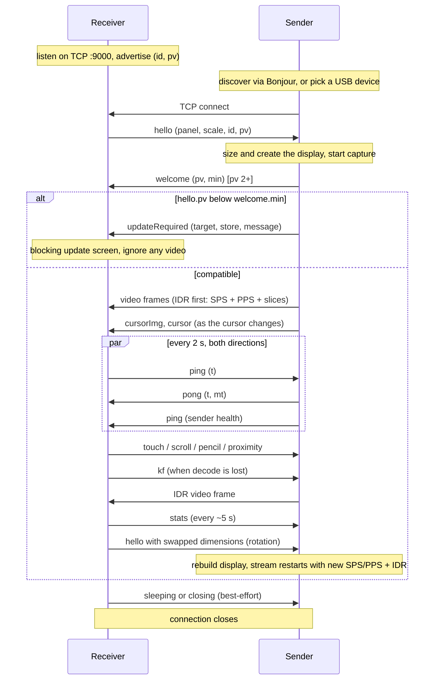

# OpenDisplay Wire Protocol

**Protocol version (`pv`): 4** &nbsp;|&nbsp; Status: **normative** for `pv <= 4`

This document specifies the wire protocol spoken between an OpenDisplay
*sender* (the machine whose desktop is extended, the Mac app today) and an
OpenDisplay *receiver* (the device that shows the extra display, the
iPhone/iPad app today). It describes everything that crosses the socket and
nothing that happens on either side of it: display creation, capture,
encoding, decoding, rendering, and input injection are implementation
details of each end and are out of scope (see [Appendix B](#appendix-b-implementers-notes-non-normative)
for non-normative hints).

Two companion documents:

* [COMPATIBILITY.md](COMPATIBILITY.md) is the policy for *evolving* this
  protocol: version negotiation rationale, the additive-by-default rule, and
  the two-phase procedure for breaking changes. This document describes the
  wire as it is; that one describes how it changes.
* [README.md](README.md) gives the product-level overview.

### Naming

The protocol is named the **OpenDisplay protocol** after the product. For
historical reasons the Bonjour service type is `_opensidecar._tcp` (the
project's original name) and it stays that way: renaming it would break
every deployed peer for zero functional gain. Do not read anything into the
mismatch.

### No support commitment

This specification exists so that independent implementations can
interoperate with the official apps and with each other. Publishing it is
**not** a commitment to ship official apps for other platforms, to keep
the protocol frozen, or to support third-party implementations. Issues
caused by third-party clients should be reported to those projects.

### Conventions

The key words MUST, MUST NOT, SHOULD, SHOULD NOT, and MAY are to be
interpreted as described in [RFC 2119](https://www.rfc-editor.org/rfc/rfc2119).
Every requirement applies to `pv` 3 unless a different version is called
out. "The official apps" means the Mac sender and iOS receiver in this
repository; their behavior is cited as illustration, not as requirement,
unless marked normative.

---

## 1. Roles and transport

* The **receiver listens** on TCP port **9000** and advertises itself.
* The **sender connects** to the receiver.

This role assignment is the most load-bearing decision in the protocol and
MUST be preserved: because the receiver is always the listening end, the
sender reaches it identically over WiFi (dial the discovered address) and
over USB (dial a tunneled port), and one code path serves both transports.

* The protocol runs over a **single TCP connection**. Video, control
  messages, and telemetry all share it, in both directions. The one
  optional exception is the UDP cursor side channel (section 6.3), which
  carries nothing a receiver cannot also get over TCP.
* There is no TLS and no authentication at `pv` 3. The protocol is designed
  for trusted local networks and direct cables. Implementations SHOULD
  disable Nagle's algorithm (TCP_NODELAY); input events are tiny packets and
  coalescing them reads as input lag.
* A receiver serves **one sender at a time**. When a new inbound connection
  arrives while one is active, the receiver MUST adopt the new connection
  and drop the old one (the official receiver cancels the old connection
  and resets its decoder state).

## 2. Transport bindings

The core protocol is transport-agnostic beyond "a TCP byte stream to port
9000 on the receiver". How the sender finds that port is a *binding*. Two
bindings exist today; ports to other platforms MAY define their own (for
example an Android receiver reachable over `adb reverse`) without touching
anything else in this document.

### 2.1 WiFi / LAN (Bonjour)

The receiver advertises a Bonjour (mDNS/DNS-SD) service:

* **Type:** `_opensidecar._tcp`
* **Name:** a human-readable, user-editable device name (defaults to the
  device's name). The name is display-only. It MUST NOT be used as a device
  identity: users rename devices, and two devices can share a name.
* **TXT record keys:**

| Key | Value | Since | Meaning |
|---|---|---|---|
| `id` | UUID string | pv 1 era | Stable per-install identity. MUST equal the `id` later sent in `hello`. Lets a sender recognize "same device, different transport/name". |
| `pv` | decimal integer as string, e.g. `"3"` | pv 2 | The receiver's protocol version. Absent means `pv` 1. Lets a sender evaluate compatibility before dialing. |

Senders MUST tolerate an absent TXT record and absent keys (pre-`pv` 2
receivers advertise neither).

### 2.2 USB (Apple devices)

For iPhones/iPads on a cable, the sender dials through **usbmuxd**, the
device-multiplexing daemon that ships with macOS and is available on Linux
and Windows via [libimobiledevice](https://libimobiledevice.org). The
sender asks usbmuxd to `Connect` to TCP port 9000 on the chosen device;
after the `OK` result the usbmuxd socket becomes a transparent byte pipe
and the protocol proceeds exactly as over WiFi.

Bonjour plays no role on this path. The official receiver classifies a
connection arriving from loopback as "USB" purely for its stats display;
this has no protocol significance.

## 3. Framing

Every message in **both directions** is length-prefixed. At `pv <= 3`:

```
[4-byte body length, unsigned, big-endian][payload]
```

At `pv >= 4` the body carries an explicit type byte (section 4.1):

```
[4-byte body length, unsigned, big-endian][1-byte frame type][payload]
```

* The length counts the **body**: the payload alone at `pv <= 3`, and the
  type byte plus the payload at `pv >= 4`. Deframing is therefore identical
  in both eras — read 4 bytes, take that many, repeat — and only the
  interpretation of the body changes.
* A frame is a **video frame** (section 5), a **control message**
  (section 6), or, at `pv >= 4`, an **audio packet**. Which one is
  determined as described in section 4.
* **Receiver to sender**, the payload MUST be `1` to `2^20 - 1` bytes. The
  official sender treats a length of 0 or `>= 2^20` as a protocol error and
  stops reading control messages on that connection.
* **Sender to receiver**, no hard maximum is enforced, but control messages
  are constrained by the demux rule below and video frames SHOULD stay in
  the low megabytes (a keyframe of a large panel).
* TCP gives no message boundaries: receivers of either role MUST buffer and
  reassemble; a frame MAY arrive split across many socket reads or packed
  together with others in one read.

## 4. Channel demux (deprecated heuristic)

All receiver-to-sender frames are JSON control messages, so the sender
needs no demux.

Sender-to-receiver frames carry both H.264 video and JSON control messages
on the same connection. At `pv <= 3` the receiver distinguishes them
**heuristically**. A frame is a JSON control message if and only if all
three hold:

1. payload length `< 32768` bytes, and
2. the first byte is `{` (0x7B), and
3. the payload contains no NUL byte (0x00).

Anything else is a video frame. This works because Annex B start codes
(`00 00 00 01`) guarantee NUL bytes in every video frame, including video
frames that *begin* with `{` (the telemetry prefix, section 5.1).

Consequences that are **normative for senders**:

* A sender MUST NOT emit a control message that is 32768 bytes or longer,
  starts with anything but `{`, or contains a NUL byte. The largest
  official control message, the base64 cursor sprite (`cursorImg`), caps
  its PNG at 24000 bytes precisely to stay under this limit after base64
  expansion.
* A sender MUST NOT emit a video frame that satisfies the JSON test (this
  cannot happen with well-formed Annex B payloads).

**Deprecation.** This heuristic is a design debt, not a feature. It is
specified here so that `pv <= 3` implementations agree on it, and it is
**replaced by the typed frame header of `pv` 4** (section 4.1). Per the
two-phase procedure in COMPATIBILITY.md section 6, this is phase one: a
`pv` 4 implementation MUST still speak the heuristic to peers below 4.
Implementers SHOULD isolate the demux decision in their code, and MUST NOT
build features that depend on the heuristic's edge cases (for example,
deliberately sending binary control data to route it to the video path).

### 4.1 Typed frames (`pv >= 4`)

At `pv >= 4` the first byte of the body names the payload's kind:

| Value | Kind | Payload |
|------:|------|---------|
| `0` | Video | Annex B H.264 (section 5) |
| `1` | Control | UTF-8 JSON (section 6) |
| `2` | Audio | Compressed audio packet |

* A receiver MUST ignore a frame whose type byte it does not recognize, and
  MUST NOT treat it as a protocol error. This is what allows new frame types
  to be added additively.
* A tagged body MUST be at least 1 byte (the type). An empty body is
  malformed and the frame MUST be discarded.
* With an explicit type, the `pv <= 3` constraints on control messages
  (under 32768 bytes, leading `{`, NUL-free) no longer apply to tagged
  frames, and audio payloads — which satisfy none of them reliably — become
  expressible. Senders MUST still honour those constraints when talking to a
  `pv <= 3` peer.

**Negotiation is ordered, and the order is normative.** A frame may be
tagged only once the peer's `pv` is known to be `>= 4`, and `pv` is learned
from `hello` (receiver to sender) and `welcome` (sender to receiver). Those
two messages are themselves sent **before** the sender of each knows what
its peer speaks, so:

* `hello` and `welcome` MUST be sent untagged, regardless of either party's
  own `pv`.
* An implementation MUST NOT tag any frame until it has read the peer's
  version, and MUST reset to untagged framing on every new connection: a
  reconnect may reach a different peer than the last session did.

A receiver therefore parses the opening frames of every connection by the
section 4 heuristic, and switches to typed parsing only after `welcome`.

### 4.2 Audio packets (`pv >= 4`)

A frame of type `2` carries one compressed audio packet: a 15-byte header,
big-endian throughout, optionally followed by a 4-byte sequence number, then
the compressed payload.

| Offset | Size | Field | Meaning |
|-------:|-----:|-------|---------|
| 0 | 1 | `codec` | `0` = AAC-LC. Other values reserved. |
| 1 | 1 | `flags` | bit 0 set = this packet begins a codec configuration; bit 1 set = a `sequence` field follows the header |
| 2 | 4 | `sampleRate` | Hz (e.g. `48000`, `44100`) |
| 6 | 8 | `ptsMs` | IEEE 754 double: capture time on the **sender's** clock, in milliseconds |
| 14 | 1 | `channels` | `1` = mono, `2` = stereo |
| 15 | 4 | `sequence` | **present only when `flags` bit 1 is set** — see below |
| 15 or 19 | … | `payload` | compressed audio |

* `sampleRate` is in **Hz**, not a scaled unit. Rates such as 22050 are not a
  whole number of kHz, and a receiver decoding at a rounded rate drifts
  against the sender for the length of the session.
* `ptsMs` shares its clock and units with the video telemetry prefix's `cap`
  (section 5.1). A receiver MUST map it onto its own clock with the offset
  from section 8.1 rather than assuming a shared epoch; that shared timebase
  is what keeps audio aligned with video without a second mechanism.
* A receiver MUST tolerate a packet whose `codec` it does not recognize, and
  a truncated packet, by discarding it. Audio arrives tens of times a second
  and a malformed packet MUST NOT end the session.
* A sender MUST NOT emit audio frames to a peer below `pv` 4: without the
  type byte such a frame is indistinguishable from video and would be fed to
  the video decoder.
* Audio is **optional in both directions**. A sender may never send it, and a
  receiver that cannot play it discards these frames and streams video
  normally.

**`sequence` (additive at `pv` 4, no bump), normative.**

* A sender MUST NOT set `flags` bit 1 unless the receiver advertised
  `hello.audioSeq: true` (section 6.1). Without that negotiation the four
  bytes would move the payload under a receiver that does not expect them, and
  a compressed audio frame read four bytes late is not a decode error — it is
  noise. This is why the field is flagged and negotiated rather than simply
  appended at `pv` 4.
* When present, `sequence` is a `UInt32` that **increases by exactly one per
  audio packet** for the lifetime of a sender session, wrapping at
  `UInt32.max`. It is a counter of packets, not of bytes, samples or
  milliseconds.
* A sender MAY restart the numbering (for instance from zero on a fresh
  session). A receiver MUST treat a jump backwards larger than any plausible
  reordering as a restart rather than as a flood of duplicates.
* A receiver that reads it SHOULD drop a packet whose `sequence` it has
  already accepted. `ptsMs` cannot serve this purpose: it is wall-clock
  milliseconds as a double, two packets encoded in the same millisecond
  compare equal, and a sender that reconnects keeps counting time. Playing one
  packet twice is audible — about 21 ms of audio under the live stream — and is
  what an echo with a jitter-buffer offset sounds like.
* A receiver MUST tolerate a packet that claims a sequence but is too short to
  hold one by discarding it, and MUST NOT fall back to reading it as an
  unsequenced packet.
* A receiver that ignores the field entirely is conformant: it MUST then read
  the payload from offset 19 rather than 15 when bit 1 is set.

## 5. Video

The video stream is **H.264 Annex B**, one *access unit* (one encoded
picture) per wire frame.

### 5.1 Frame layout

```
[optional telemetry prefix: JSON, no start codes]
[00 00 00 01][NALU] [00 00 00 01][NALU] ...
```

* **Telemetry prefix.** Everything before the first start code, if
  anything, is a JSON object stamped by the sender:
  `{"cap":<ms>,"snd":<ms>}` where `cap` is the capture timestamp and `snd`
  the send timestamp, both milliseconds since the Unix epoch on the
  sender's clock. Receivers MUST tolerate its absence and MUST ignore
  unknown fields; it exists only for latency measurement (combined with the
  clock offset from section 8.1). Senders SHOULD include it.
* **Start codes are always 4 bytes** (`00 00 00 01`). Senders MUST NOT emit
  3-byte start codes; receivers MAY therefore split on the 4-byte pattern
  only. (A receiver that also handles 3-byte codes works today by accident;
  do not rely on it in either direction.)
* **Keyframes carry their parameter sets.** Every IDR frame MUST be
  prefixed with the current SPS and PPS NALUs. Non-keyframes carry only
  slice data (plus optional SEI, which receivers MAY skip).
* All slices of one picture MUST travel in one wire frame; receivers SHOULD
  decode each wire frame as one sample.
* **No presentation timestamps** cross the wire. The stream is low-latency
  (no B-frames in the official sender); receivers display frames in arrival
  order, as fast as they arrive.

### 5.2 Stream changes

The encoded video size is chosen by the sender and MAY differ from the
panel size announced in `hello` (the official sender offers reduced-scale
quality presets). Receivers MUST take the video dimensions from the SPS,
never from `hello`.

When the stream changes size (device rotation, quality change), the sender
simply starts sending frames with new SPS/PPS. Receivers MUST detect the
parameter-set change, rebuild their decoder, and discard buffered frames
from the old format.

This is no longer rare. The official sender's congestion control lowers the
**capture scale** when the link cannot carry the pixel rate at any bitrate,
so a mid-session size change is now an ordinary event on a mobile link
rather than something only a rotation produces. The panel size announced in
`hello` does **not** change with it — the sender's virtual display keeps its
mode, so the desktop layout does not move — which is another way of saying
what this section has always said: take the video dimensions from the SPS.

### 5.3 Keyframe recovery

A receiver that cannot decode (it joined mid-GOP, lost its decoder, or
resumed from background) requests a keyframe with the `kf` control message
(section 6.1). The sender MUST respond by making the next transmitted frame
an IDR (with SPS/PPS, per 5.1). Senders SHOULD also send an IDR unprompted
whenever a connection is (re)established, including replaying the last
captured frame if the screen is static and the capturer produces nothing.

## 6. Control messages

Control messages are JSON objects encoded as UTF-8, each in its own frame
(section 3), each with a **`type`** field holding a string discriminator.
All other fields are type-specific.

Two rules make the protocol evolvable, and both are **normative**:

* **Unknown `type` values MUST be ignored** (logging is fine, but at most
  once per type, not per message: input types arrive at hundreds of
  messages per second). A newer peer may send types this implementation
  predates; that is normal, not an error.
* **Unknown fields on a known type MUST be ignored**, and optional fields
  MUST be tolerated when absent. New fields are added without a version
  bump.

An unparseable control payload (not JSON, or no `type`) MUST be ignored,
not treated as fatal.

Numbers are JSON numbers; nothing distinguishes int from float on the wire.
Coordinates use the conventions of section 7.

### 6.1 Receiver to sender

| `type` | Since | Fields | Purpose |
|---|---|---|---|
| `hello` | pv 1 | `pixelsWide`, `pixelsHigh`, `scale`, `device`?, `id`?, `pv`?, `audioSeq`? | Identify the panel; (re)sent on connect and on rotation |
| `ping` | pv 1 | `t` | Liveness + clock sync probe |
| `touch` | pv 1 | `phase`, `x`, `y`, `button`?, `t`? | Finger, trackpad and mouse button input |
| `scroll` | pv 1 | `dx`, `dy`, `phase`? | Two-finger / trackpad / wheel scroll; `phase` is additive at pv 3 |
| `pointer` | pv 3 | `phase`, `x`, `y`, `t`? | Indirect-pointer hover: move the cursor, press nothing |
| `key` | pv 3 | `code`, `down`, `mod`, `char`? | Hardware keyboard key transition |
| `modSidebar` | pv 3 | `flags` | Latched modifiers from an on-screen modifier sidebar |
| `zoom` | pv 3 | `scale`, `phase`, `x`?, `y`? | Pinch-to-zoom, as an incremental magnification factor; `x`/`y` are the pinch centroid, additive at pv 4 |
| `pencil` | pv 3 | `phase`, `x`, `y`, `pressure`, `azimuth`, `altitude`, `rotation`, `t`? | Stylus input |
| `proximity` | pv 3 | `entering`, `x`, `y` | Stylus hover enter/leave |
| `kf` | pv 1 | none | Request an IDR (section 5.3) |
| `stats` | pv 1 | free-form, `sq`? | Receiver-side telemetry for the sender's log and congestion control |
| `sleeping` | pv 2 | none | Device locked; session ends, reconnect on wake expected |
| `closing` | pv 2 | none | App quit; session ends for good |
| `rejected` | pv 4 | `retryAfterMs`?, `reason`? | "Not you" — this receiver is configured for a different sender (section 6.6) |

**`hello`** MUST be the first message a receiver sends on every new
connection, because the sender sizes its virtual display from it and can do
nothing before it arrives.

* `pixelsWide`, `pixelsHigh` (int): the panel size in **physical pixels**,
  in the panel's **current orientation** (portrait swaps them).
* `scale` (number): the device's UI scale factor (2 or 3 on Apple
  hardware). The sender uses it to pick a sensible point-size for the
  virtual display.
* `device` (string, optional): device kind for UI text, `"iPhone"` or
  `"iPad"` from the official receiver. Free-form.
* `id` (string, optional): stable per-install UUID. MUST match the Bonjour
  TXT `id`. Senders use it to recognize the same physical device across
  transports and renames.
* `pv` (int, optional): the receiver's protocol version. **Absent means
  1** (every pre-handshake install).
* `cursorPort` (int, optional): a UDP port on the receiver that accepts
  cursor datagrams (section 6.3). Present only while that listener is
  actually bound. Absent means the receiver takes cursor positions over
  TCP only. Additive at `pv` 3, no bump.
* `addrs` (array of strings, optional): every IP address the receiver is
  reachable on (section 6.4). Link-local IPv6 entries carry no zone id.
  The receiver SHOULD re-send `hello` when this set changes (a cable
  plugged mid-session creates the interface the sender must probe).
  Additive at `pv` 3, no bump.
* `maxEncodeWide` / `maxEncodeHigh` (int, optional): the receiver's decode
  ceiling in pixels (section 6.5) — the largest stream it can sustain,
  independent of the panel size it announced. Additive at `pv` 3, no bump.
* `audioSeq` (bool, optional): the receiver understands the optional
  `sequence` field of an audio packet (section 4.2) and will use it to detect
  duplicates. A sender MUST NOT stamp packets unless it has seen this set to
  `true` on the live connection; absent or `false` means the 15-byte header
  and nothing after it. Additive at `pv` 4, no bump. Re-asserted on every
  `hello`, because an adopted connection may be a different receiver.

A receiver MUST re-send `hello` on the live connection whenever its
announced dimensions change (rotation). The sender rebuilds the display in
response; the official sender debounces this by 300 ms so an orientation
flurry settles into one rebuild, and replies to *every* `hello` with a
fresh `welcome` (receivers treat repeats idempotently).

**`ping`** carries `t` (number): milliseconds since the Unix epoch on the
receiver's clock. The sender MUST reply with `pong` echoing `t` (section
6.2, 8.1). Receivers SHOULD ping every ~2 s; see section 8.2 for why this
cadence is load-bearing.

**`touch`** carries `phase` (string): one of `"began"`, `"moved"`,
`"ended"`, `"cancelled"`; `x`, `y` (numbers): normalized position (section
7); `t` (number, optional): the event timestamp expressed **in the
sender's clock** (the receiver adds its measured clock offset before
stamping, so the sender can compute input latency without its own sync).
Senders MUST tolerate an absent `t` (it is omitted until the offset is
known).

* `button` (string, optional): `"left"` (default) or `"right"`. Absent means
  `"left"`, which is what every pre-existing receiver sends and what makes
  this field additive at `pv` 3 with no bump. Receivers SHOULD omit it
  rather than spell out `"left"`.

  A receiver MAY set it on the `"began"` message only; senders MUST follow
  the button the press started with for the matching `"moved"`, `"ended"`
  and `"cancelled"` messages rather than re-reading the field, so a
  right-button drag cannot decay into a left one. A sender that does not
  understand `button` degrades to a left click, which is the pre-`button`
  behaviour.

  The official receiver produces `"right"` from a two-finger tap and from a
  trackpad/mouse secondary click.

**`scroll`** carries `dx`, `dy` (numbers): scroll deltas in **video
pixels** (section 7) with **natural-scrolling sign** (content follows the
fingers: fingers moving down produce positive `dy` and the scrolled content
moves down).

The same message carries trackpad and mouse-wheel scrolling. The receiver
is responsible for resolving its own platform's "natural scrolling"
preference before it sends, so the sign on the wire always means
content-follows-input and the sender needs no knowledge of the receiver's
settings.

**`scroll.phase`** (additive at `pv` 3, no bump) is an optional string that
tells the sender whether a finger is still on the glass, whether the content
is coasting, and when either ended. Senders MUST ignore a phase they do not
recognize — and MUST still apply the `dx`/`dy` of the message carrying it.

| `phase` | Meaning |
|---|---|
| `"began"` | A scroll gesture started; a finger (or two) is down. |
| `"changed"` | The gesture is continuing. |
| `"ended"` | The finger left the glass. Exactly one per `"began"`. |
| `"momentumBegan"` | The content is now coasting on its own. |
| `"momentumChanged"` | A coasting sample. |
| `"momentumEnded"` | The coast is over. Exactly one per `"momentumBegan"`. |

A message with no `phase` is the message every build since `pv` 1 has sent:
an isolated wheel-style scroll belonging to no gesture. That is what a mouse
wheel is, and it stays the correct encoding for one.

Normative rules for a receiver that sends phases:

* exactly one `"ended"` per `"began"`, on **every** exit path including
  cancellation — a sender may be showing a scroll-bar overlay or holding a
  rubber-band until it arrives;
* a momentum run, if any, follows the `"ended"` and is closed by exactly one
  `"momentumEnded"`;
* the phases are a **description of the receiver's gesture**, not a request:
  a `"began"` and an `"ended"` may legitimately carry `dx`/`dy` of 0, and a
  sender MUST post them anyway, because their whole content is the phase.

The phases exist because a platform can distinguish a scroll *gesture* from a
wheel click and behave differently: on macOS they become
`kCGScrollPhase*`/`kCGMomentumScrollPhase*`, which is what produces
rubber-banding at a document's edge, the scroll-bar overlay, and inertia in
AppKit and WebKit. A sender that ignores them scrolls by exactly the same
deltas, which is why this is additive.

**`zoom`** (additive at `pv` 3, no bump) reports a pinch. It carries:

* `scale` (number): the **incremental** magnification factor since the last
  `zoom` message of this gesture — 1.05 means "5% larger than the last
  sample", *not* "5% larger than when the pinch started". Incremental
  because the sender then needs no gesture state, and a dropped message
  costs a fraction of a step instead of desynchronizing the zoom level for
  the rest of the session.

  **This is the field's one real hazard, and it has been tripped over.** Every
  gesture recognizer worth using reports a *cumulative* scale, so the obvious
  implementation is the wrong one, and the two are indistinguishable at the
  first sample. Normatively:

  * the product of every `changed` message's `scale` in one gesture MUST equal
    the gesture's total magnification. If a receiver sends the recognizer's
    running total instead, that product is its own factorial-like blow-up: a
    gesture that grows 4% per sample over 24 samples reports a net factor of
    about 2·10⁵ rather than 2.5;
  * a receiver MUST NOT rely on a recognizer's "reset the scale to 1" affordance
    to produce the increment. On at least one platform that setter is silently
    ignored for *indirect* (trackpad) pinches, where there is no touch
    separation to re-base against, and the failure is invisible from the
    receiver's own side. Dividing this sample's cumulative scale by the
    previous one is correct either way;
  * a receiver SHOULD bound the factor it sends. A recognizer re-bases its
    scale when the number of contacts changes, exactly as it re-bases a pan's
    translation, and that shows up as one enormous ratio that is an artefact
    rather than a gesture. The official iOS receiver clamps to ±25% per message
    and reports how often the clamp bit;
  * an incremental `scale` in real use is a small number: an iPad pinch at
    120 Hz reports steps in the 1.001–1.05 range. A sender that regularly sees
    values far outside that band is talking to a receiver sending cumulative
    scales, and SHOULD say so in its log rather than obeying them silently.
* `phase` (string): `"began"`, `"changed"`, `"ended"` or `"cancelled"`. A
  sender MUST treat `"began"`, `"ended"` and `"cancelled"` as boundaries
  that reset whatever it accumulates, and MUST ignore a phase it does not
  recognize.

  `"cancelled"` means the receiver's gesture recognizer lost the fingers to
  something else, not that the zoom should be undone: whatever was applied
  stays applied. A sender that injects a platform gesture SHOULD close its
  gesture series with the platform's **ended** phase for a `"cancelled"`
  message as well, and keep the distinction only in its log. The two phases
  are not equally well handled: an application that tracks a gesture series
  invariably has a branch for "ended" and may have none for "cancelled", and
  the cost of a missing branch is a gesture left open for the rest of the
  session.
* `x`, `y` (numbers, **additive at `pv` 4**): the **pinch centroid**,
  normalized `[0,1]` in video space with the same origin and sign as `touch.x`
  / `touch.y` (section 7). Both or neither — half a coordinate is not a point.

  This is the field that decides whether the zoom happens *to anything*. A
  sender applies zoom at a position: a platform magnification event is routed
  to the window under its location, and an application that zooms towards the
  pointer needs the pointer to be where the fingers are. A sender has no way to
  know that position — its own cursor is wherever the last click left it, which
  may be a different window or a different display — so a `zoom` without a
  centroid is a zoom aimed at whatever the cursor was last used for. Receivers
  SHOULD send it on every message of the gesture.

  A receiver SHOULD send it for an **indirect** (trackpad or mouse) pinch too,
  where the centroid is the pointer's own position: it costs nothing, it is the
  correct anchor for that case, and it means the sender needs no rule about
  which kind of pinch it is looking at.

  A sender MUST tolerate its absence by falling back to its own cursor
  (everything before `pv` 4 did exactly that), MUST clamp a value slightly
  outside `[0,1]` rather than discarding the gesture, and MUST reject a
  non-finite one. A sender SHOULD adopt the centroid **once per gesture**
  rather than following it sample by sample: a physical trackpad does not move
  the pointer while a pinch runs, and re-targeting mid-gesture moves the zoom to
  a different window halfway through it.

A sender MUST tolerate a non-finite, zero or negative `scale` (the wire is
JSON from an unauthenticated peer) by ignoring that message, and MUST bound
the effect a single message can have: an accumulating implementation given
`{"scale": 1e300}` must not spend a thousand actions on it, and one that
injects a platform magnification event must not hand that number to the
application under the cursor. The official Mac sender clamps the delta it
injects to ±0.25 per message — five times the top of anything real fingers
produce — and counts the messages that hit the clamp.

A receiver SHOULD send a `"changed"` message for **every** sample its gesture
recognizer reports, including ones whose `scale` is exactly 1, and SHOULD NOT
apply a threshold of its own. A `zoom` message is ~45 bytes; a sender that
renders the pinch continuously needs the cadence, and one that accumulates
loses nothing by receiving it.

How a sender *applies* zoom is deliberately unspecified — it is the one input
message with no direct equivalent on the injection side, and the two
strategies differ enough that pinning one would be wrong for some platform.
The official Mac sender synthesises a continuous magnification gesture by
default and can be switched to ⌘= / ⌘- per threshold step; see Appendix B.

**`pencil`** (pv 3) carries `phase` (string): `"down"`, `"move"`, `"up"`,
or `"hover"`; `x`, `y`: normalized position; `pressure` (number): 0 to 1;
`azimuth`, `altitude` (numbers): stylus orientation in radians (altitude
pi/2 = perpendicular to the screen); `rotation` (number): barrel roll in
radians, currently always 0; `t`: as in `touch`. A `"move"` while the pen
is up is a hover move.

**`proximity`** (pv 3) carries `entering` (bool) and the normalized `x`,
`y` where the stylus entered or left hover range.

**`pointer`** (additive at `pv` 3, no bump) reports an **indirect
pointer** — a trackpad or mouse driving the receiver's own pointer —
hovering over the video, so the sender can move its cursor without pressing
anything. It carries `phase` (string), `x`, `y` (normalized position, section
7) and `t` (number, optional, as in `touch`). Senders MUST ignore phases they
do not recognize.

| `phase` | Meaning |
|---|---|
| `"began"` | The pointer entered the video. Move the cursor there, and treat this as the start of a fresh motion epoch. |
| `"move"` | The pointer moved within the video. |
| `"ended"` | The pointer left the video. The sender MUST NOT move the cursor in response — it stays where the user left it. |

`"move"` alone is a complete implementation of the feature; the enter/leave
phases exist for senders that expose **relative** motion to applications
(`CGEvent`'s `mouseEventDeltaX/Y`, games, 3D viewports). A delta is only
meaningful between two consecutive samples of the same hover: the cursor can
be moved by touch, by a stylus, or by the sender's own user between epochs,
and reporting that jump as pointer motion is a flick nobody performed. A
sender that offers relative motion therefore MUST reset its reference point on
`"began"`, on `"ended"`, and whenever any other input path moves the cursor.

`pointer` is deliberately separate from `touch`: a `touch` with phase
`"moved"` and no button held already means "move the cursor", but it shares
the touch state machine, and a receiver that has both a finger on the glass
and a pointer on a trackpad must be able to say which one moved. A sender
that does not implement `pointer` simply does not track the pointer; nothing
breaks.

Receivers SHOULD suppress `pointer` while a pointer button is held, because
the button-down, drag and release travel as `touch` with `button` and own
the cursor position for the duration of the drag.

**`key`** (additive at `pv` 3, no bump) is one key transition from a
hardware keyboard attached to the receiver:

* `code` (int): the **USB HID Keyboard/Keypad usage page (0x07) usage ID**
  of the key — 0x04 for the key labelled A on a US layout, 0xE6 for right
  Option, and so on. This is a *position*, not a character: the sender maps
  it to its own platform's keycode and lets its own selected input source
  decide the character. That is what makes non-Latin layouts work, and it
  is why the usage ID — not the character — is the normative field.
  Senders MUST range-check it (it is a 16-bit usage) and ignore values outside
  that range rather than trusting the peer; the wire is unauthenticated, so a
  blind conversion is a remote crash. The same applies to every other
  peer-supplied number on the input path.
* `down` (bool): true for a press, false for a release. Receivers MUST send
  a release for every press, including when the platform cancels the press
  (an app switch, a lost keyboard), or the sender will be left with a key
  stuck down.
* `mod` (int): the modifier bitmask in effect for this transition, using
  **UIKit's `UIKeyModifierFlags` bit positions** (1<<16 alpha-shift/caps
  lock, 1<<17 shift, 1<<18 control, 1<<19 option/alt, 1<<20 command,
  1<<21 numeric pad). Note this cannot distinguish left from right; a
  sender that cares MUST track the modifier usages in `code` instead.
* `char` (string, optional): the character the receiver's own layout
  produced. Senders SHOULD use it **only** for usages they have no keycode
  for (media keys and the like); using it for mapped keys overrides the
  sender's input source and breaks non-Latin layouts and dead keys.

Auto-repeat is **not** on the wire. iOS delivers no repeat events for a
held key, so a receiver has nothing to forward; senders that want repeat
MUST generate it themselves from the unmatched `down: true`, using their own
platform's repeat delay and rate, and MUST stop on the matching release, on
disconnect and on session reset. Senders MUST NOT assume a repeat stream.

**`modSidebar`** (additive at `pv` 3, no bump) carries `flags` (int): a
`UIKeyModifierFlags` bitmask of modifiers **latched** by an on-screen
modifier sidebar, for receivers with no hardware keyboard. It is state, not
an event: the receiver sends the full new set on every change, and the
sender ORs it into the flags of subsequent `key`, `touch` and `pointer`
events until told otherwise. `{"flags":0}` clears it.

**Reassertion across connections (normative).** `modSidebar` is scoped to a
connection. A sender MUST clear its latched set whenever a connection becomes
ready, and MUST clear it when a session ends (it is part of the
release-on-disconnect rule below). A receiver that latches modifiers MUST
therefore re-send the current set after every `hello` — `hello` is the one
message sent on every new *and* adopted link, and a receiver can be adopted by
a replacement connection (a path migration, a redial inside the sender's
disconnect grace) without its own "connected" state ever going false. Without
the reassertion the receiver's UI goes on claiming a modifier the sender has
already forgotten. Sending nothing when the set is empty is correct, since the
sender starts every connection cleared.

A sender that latches these flags MUST NOT apply them to a *physical*
modifier's own transition event, only to the keys, buttons and pointer moves
they modify: the flags are virtual and the sender never announced them going
down, so asserting them on a real modifier transition makes the next real
release look like the virtual one going up too.

**Input state on disconnect (normative):** a sender MUST release every
input it is holding on behalf of a receiver when the session ends —
pressed mouse buttons, stylus contact and proximity, held keyboard
modifiers, and any auto-repeat it started. A session that dies with a
button or ⌘ held otherwise leaves the sender's desktop unusable.

**Pencil fallback (normative):** a receiver MUST NOT send `pencil` or
`proximity` to a sender whose `pv` is below 3; it MUST degrade the stylus
to `touch` events instead. (An old sender would ignore the unknown types
and the stylus would go dead; the fallback keeps it usable.)

**`stats`** is free-form telemetry, so both ends stay diagnosable from one
log file. The official receiver sends it every ~5 s with fields like
`transport`, `fps`, `mbps`, `e2e50`, `e2e95`, `enc50`, `rtt`, `stalls`,
`dec50`, `ph50`, `ph95`, `offsetKnown`. No field is normative; senders MUST
accept any object.

It is no longer *only* logged. A sender MAY use it to steer the stream —
the official one estimates the deliverable rate from `mbps`, and treats
`e2e50`/`e2e95` rising above a per-session baseline as a queue building
(congestion with no drops at all). Two consequences follow, and both are
recommendations rather than requirements because a sender that ignores
`stats` entirely is still conformant:

* a receiver SHOULD send `stats` on a fixed cadence and SHOULD NOT skip
  reports when the link is bad, because that is when they matter;
* a sender SHOULD distinguish "no report arrived" from "a report arrived
  saying zero". They are not the same measurement, and on a congested link
  the first is common.

`sq` (unsigned integer, optional, additive at `pv` 4) is a per-connection
sequence starting at 1 and incrementing by one per report. It exists
because a report may now arrive twice — see section 6.3.

**`sleeping`** and **`closing`** let the
sender distinguish "device locked, it will come back" (keep listening for a
wake, tear the display down in the meantime) from "user quit the app" (end
the session, stop redialing). Both are courtesy messages sent best-effort
right before the receiver closes the connection; senders MUST NOT rely on
receiving them (a cut cable produces neither).

### 6.2 Sender to receiver

These ride the same connection as video and MUST satisfy the demux rule of
section 4.

| `type` | Since | Fields | Purpose |
|---|---|---|---|
| `pong` | pv 1 | `t`, `mt` | Clock-sync reply |
| `ping` | pv 1 | `drops`?, `encDrops`?, `netDrops`?, `pending`?, `inp50`?, `inp95`?, `capFps`? | Liveness + sender health |
| `cursor` | pv 1 | `x`?, `y`?, `v` | Cursor position/visibility |
| `cursorImg` | pv 1 | `nw`, `nh`, `ax`, `ay`, `png` | Cursor sprite |
| `welcome` | pv 2 | `pv`, `min`, `host`?, `senderID`?, `statsUdp`? | Sender's side of the version handshake, plus who it is and what it reads |
| `updateRequired` | pv 2 | `target`, `store`, `message` | Peer must update to continue |
| `streamConfig` | pv 3 (additive) | `codec`, `width`, `height`, `framesPerSecond` | Selected video operating point |

**`pong`** echoes the `t` from the receiver's `ping` unchanged and adds
`mt`: milliseconds since the Unix epoch on the sender's clock at the moment
of the reply. See section 8.1.

**`ping`** (sender-to-receiver) is primarily a liveness beat (section
8.2). The official sender piggybacks send-side health counters on it for
the receiver's performance overlay: `encDrops`/`netDrops` (frames dropped
at the encoder / network stage), `drops` (legacy combined counter, superseded
by `encDrops`), `pending` (in-flight sends), `inp50`/`inp95` (input latency
percentiles, ms), `capFps` (capture rate). All fields optional,
informational only. Note the asymmetry: the receiver's `ping` solicits a
`pong`; the sender's does not.

**`cursor`**: `v` is 1 (visible) or 0 (hidden). When visible, `x`, `y`
give the normalized position (section 7); when hidden they MAY be absent.
The cursor rides the control path rather than being baked into the video
so it moves at input rate, not at video latency; the official sender emits
up to 120 updates/s, deduplicated by movement threshold. Receivers without
cursor rendering MAY ignore both cursor messages.

**`cursorImg`** delivers the current cursor sprite: `png` is the base64 of
a PNG (kept under 24000 bytes pre-encoding, see section 4); `nw`, `nh` are
the sprite's width/height **normalized to the display size**, so the
receiver can scale it without knowing the sender's HiDPI factor; `ax`, `ay`
are the hotspot **normalized within the sprite** (0..1 of its own size).
Sent when the sprite changes and re-sent after reconnects.

**`welcome`** carries the sender's protocol version (`pv`) and the oldest
receiver version it still supports (`min`); see section 10. Two optional
fields identify the *machine*, additively at `pv` 4 with no bump:

* `host` (string): the sender's computer name, for a human to recognise it
  by. It may change at any time and two senders may share one; it is a
  label, never an identity.
* `senderID` (string): a stable, opaque per-installation identifier, in
  practice a UUID persisted in the sender's own settings. It survives
  restarts, renames and network changes.

A receiver MUST tolerate both being absent — every sender below this
revision omits them — and MUST NOT treat `host` as unique. A sender SHOULD
send `welcome` on every `hello` it receives; receivers MUST tolerate
repeats.

One further optional field, additive at `pv` 4 with no bump:

* `statsUdp` (bool): this sender reads `stats` datagrams on the UDP cursor
  flow (section 6.3). Absent or false means the receiver MUST send `stats`
  over TCP only, which is what every receiver did before this revision.

### 6.3 Cursor side channel (UDP)

Cursor positions share the TCP connection with video frames of several
hundred KB. Over WiFi one late frame holds every cursor update queued
behind it (head-of-line blocking), and the cursor stutters while the video
is fine. The side channel moves the position messages, and only those, onto
UDP where a lost or late datagram costs nothing: the next one supersedes it.

* **Capability-gated and optional.** A receiver that offers it binds a UDP
  listener (the official receiver uses TCP port + 1, so 9001 by default)
  and advertises the port as `hello.cursorPort`. A sender that sees no
  `cursorPort`, or cannot reach it, MUST keep sending `cursor` over TCP.
  Either side may lack the feature with no loss beyond cursor smoothness.
* **Bindings.** WiFi/LAN only. usbmuxd (section 2.2) tunnels TCP streams
  and cannot carry UDP; a sender on the USB binding MUST ignore
  `cursorPort`. The sender dials the same host the TCP connection reached.
* **Datagram format.** One datagram is one `cursor` message (section 6.2)
  as UTF-8 JSON, without the 4-byte length prefix, plus `s` (unsigned
  integer): a sequence number that starts at 1 and increments by one per
  datagram sent, e.g. `{"type":"cursor","x":0.4210,"y":0.7735,"v":1,"s":88}`.
  Nothing but `cursor` messages travel here; `cursorImg` stays on TCP
  because a sprite must arrive intact.
* **Sequence semantics.** The receiver keeps the highest `s` seen and MUST
  drop any `cursor` message — datagram or TCP frame — whose `s` is not
  greater than it (UDP reorders, and around a path switch a TCP frame
  queued behind video can arrive after a newer datagram). The sequence is
  per TCP session: it restarts when the TCP connection is (re-)established
  and runs across both paths. The receiver resets its tracker on every new
  TCP connection and on every new UDP flow, and accepts datagrams only
  from the most recently seen flow. A TCP `cursor` frame without `s` (an
  older sender) applies unconditionally.
* **Delivery confirmation.** `.ready` on a UDP socket proves only a local
  route — a firewalled port would swallow the cursor silently. On the
  first accepted datagram of a flow the receiver sends `cursorAck` (a
  control message with no other fields) over TCP. Until it arrives the
  sender MUST keep mirroring every position onto TCP (same `s`, so the
  receiver deduplicates); if no ack arrives within a few seconds the
  sender SHOULD drop the UDP flow and stay on TCP. A receiver that stops
  listening mid-session SHOULD re-send `hello` without `cursorPort` to
  withdraw the offer.
* **Mixing.** A sender MAY switch between UDP and TCP for `cursor` at any
  time. Both deliver into the same cursor state on the receiver.
* **The reverse direction: `stats`.** A UDP flow is bidirectional, and the
  receiver MAY send `stats` (section 6.1) back along it as a datagram —
  same encoding as a `cursor` datagram, i.e. the JSON object with no length
  prefix. It is the only message that travels this way. Gated on
  `welcome.statsUdp`: a receiver MUST NOT send it to a sender that has not
  advertised the field, because a sender that does not read the flow would
  simply never see it and a sender that reads it as a `cursor` message
  would misparse it.

  **Both copies are sent.** The receiver sends every report over TCP *and*
  as a datagram; it MUST NOT suppress the TCP copy. A dropped datagram then
  costs nothing, and a sender that reads only TCP is unaffected.

  The sender MUST deduplicate on `sq`: apply a report only when its `sq` is
  greater than the highest yet seen on this connection, whichever channel
  carried it, and discard the other copy. `sq` restarts with the TCP
  connection, so the sender MUST rewind its tracker when a connection is
  (re-)established. A `stats` message with no `sq` (a receiver that predates
  this) is applied unconditionally — such a receiver sends only the TCP
  copy, so there is nothing to deduplicate against.

  **Why.** `stats` is the sender's only view of the far end, and over TCP it
  queues behind the video on the same connection. On a relayed mobile link
  that is measured in tens of seconds: one session logged reports 54, 7, 20
  and 43 seconds apart against a nominal 5. A sender doing congestion
  control is then blind exactly when the link is worst. The datagram skips
  the queue.
* **Firewall note.** A receiver offering the channel now also listens on
  UDP (port + 1 for the official receiver). The official Mac receiver
  therefore needs UDP 9001 open in addition to TCP 9000.

### 6.4 Cable upgrade (`hello.addrs`)

A Mac-to-Mac cable — Thunderbolt/USB4 (Thunderbolt Bridge) or plain USB-C
on recent macOS (host-to-host networking, gated by the "allow accessory"
consent on each Mac) — appears as a network interface on both ends. It is
always the better path than WiFi, but nothing guarantees a Bonjour dial
lands on it: mDNS resolution under an interface-restricted dial can stall,
and an unrestricted dial races all resolved addresses and often keeps
WiFi.

`hello.addrs` closes the gap. A receiver that can carry a session over a
host-to-host cable (today: a Mac — a cabled phone reaches the sender over
usbmuxd instead, and a phone's advertised WiFi address would only invite
a false "upgrade" onto a path that still crosses its radio) lists the
addresses it is reachable on; a sender whose live TCP session runs over WiFi SHOULD
periodically probe those addresses (link-local IPv6 re-scoped to each of
its own plausible interfaces) with WiFi forbidden, and on the first probe
that connects over a non-WiFi path, move the session onto it: the probe
connection simply becomes the session connection, and the receiver's
newcomer handling (a newcomer proves itself with bytes before it may
replace a live session) swaps it in cleanly. The abandoned WiFi socket is closed
by the sender. A sender already on a wired path, or on the USB (usbmuxd)
binding, does not probe.

The upgrade is one-way by design. When the sender judges that a session
rides the direct host-to-host cable — a wired path, to a link-local peer
address (fe80::/10 or 169.254/16), on a receiver class that can be cabled
(today: a Mac; all three conditions, since link-local peers also occur on
bridged or DHCP-less LANs where no cable joins the two machines) — it
SHOULD treat the death of that connection as intent and end the session
rather than redial over WiFi: pulling the cable is how a person
deliberately ends a session, and a WiFi fallback would resurrect what
they just closed. Every other session death keeps the reconnect loop: a
radio drop is never intent, and a routed wired path (a docked sender
streaming to a receiver on WiFi) going quiet says nothing about a cable.
Once a sender decides to redial, the dial's own failures follow the
normal reconnect rules — only the death of the live cable connection
itself is intent.

**`welcome`**: the sender's `pv` and `min` (the oldest receiver `pv` it
still supports). Sent in response to every `hello`. A receiver whose own
`pv` policy is not met by the sender (`welcome.pv < ` its minimum) is the
only party that can detect an outdated sender and SHOULD tell its user to
update the sender. A receiver that never gets a `welcome` at all is talking
to a pre-pv-2 sender and MUST assume sender `pv` 1.

**`updateRequired`**: the sender declares the pairing unsupported until the
receiver updates. `target` names the end that must act (`"ios"` today),
`store` is a platform-appropriate update URL, `message` is user-facing
prose. Receivers SHOULD surface it prominently and stop expecting video —
but MUST NOT depend on the video actually stopping: the official sender
currently keeps streaming after sending it and relies on the receiver to
block its own UI. At `pv` 3 this is only sent when
`hello.pv < welcome.min`, which never happens while `min` is 1; the
machinery exists so a future floor raise degrades into a clear message
instead of a silent failure.

**`streamConfig`** announces the sender's selected video configuration before
the first video frame and again after a reconnect or stream reconfiguration.
`codec` is a lowercase token (`"h264"` today); `width` and `height` are encoded
pixels; `framesPerSecond` is the maximum submission rate. Receivers MUST ignore
unknown fields. A receiver that gets video without `streamConfig` MUST assume
the legacy H.264 stream. A sender MUST NOT select a non-H.264 codec unless the
receiver affirmatively advertised it in `videoCaps`.

### 6.5 Video capabilities and legacy decode ceiling

Each `hello.videoCaps` entry is an object with a required lowercase `codec`
token and these optional positive integer limits:

| Field | Meaning |
|---|---|
| `maxWidth`, `maxHeight` | Maximum encoded raster for that entry |
| `maxFrameRate` | Maximum stream rate for that entry |
| `maxPixelsPerSecond` | Maximum encoded pixel throughput for that entry |

All limits present in one entry apply **together**. Multiple entries for the
same codec are alternative supported envelopes; they are not maxima that may
be freely combined. Unknown codecs and fields MUST be ignored. The sender
intersects a receiver entry with its own encoder constraints and the requested
desktop/quality policy, then reports the result with `streamConfig`.

The official receiver currently advertises H.264 only. This structure makes a
future codec additive without changing the meaning of panel dimensions or
assuming support from a peer that merely ignored an unknown field.

The current H.264 sender also enforces the High@L5.2 frame-size and
macroblock-rate limits locally. For a 16:9 5K source that codec rule selects
4096×2304 at 55 FPS; it is not a receiver-model or 5K-iMac exception. A future
codec supplies its own encoder constraints while using the same capability
intersection and `streamConfig` announcement.

`hello.maxEncodeWide` / `maxEncodeHigh` is the legacy H.264 decode ceiling:

`hello.pixelsWide/High` sets the desktop size, and without further
information it also sets the stream size — but a big panel says nothing
about the decoder behind it. Measured end to end, H.264 hardware decode
stops below 5120 pixels wide on every Mac tested, current models
included: a 5K panel asking for a 5K H.264 stream gets a session the
receiver cannot sustain, which degrades confusingly instead of failing
cleanly.

Both fields are optional and additive (no `pv` bump). A receiver MAY
advertise the largest stream, in pixels, it can actually decode at
frame rate; a sender that understands the fields SHOULD keep the
desktop at the announced panel size and, when the stream it would
encode exceeds the ceiling, scale the stream down to fit inside it,
preserving aspect. A ceiling the stream already fits inside changes
nothing, and a receiver that omits the fields gets the previous
behavior (stream size follows the announced pixels and the sender's
quality setting). Derive advertised ceilings from measured playback: a
decode session that merely creates successfully proves nothing.

### 6.6 Choosing a sender (`rejected`)

Senders dial and receivers listen (section 1). With two senders able to
reach one receiver — two Macs on one LAN, or on one overlay network — the
receiver's single connection goes to whichever dials first, which is a race
and not a choice. The receiver is the only party in a position to arbitrate,
and `welcome.senderID` is what lets it.

| `type` | Since | Direction | Fields | Purpose |
|---|---|---|---|---|
| `rejected` | pv 4 (additive) | receiver → sender | `retryAfterMs`?, `reason`? | "Not you. Try again later." |

A receiver that is configured to accept a specific sender and finds, from
`welcome.senderID`, that this is not that sender, SHOULD send `rejected`
and then close the connection. It MUST NOT simply close: a bare close is
indistinguishable from a network failure, and a sender is right to redial
one immediately — which is how a refusal becomes a connect/refuse loop.

* `retryAfterMs` (number, optional): how long the sender is asked to wait
  before dialing this receiver again. Absent means the sender chooses;
  the official sender treats absent as 30 000.
* `reason` (string, optional): why, for logs and UI. Defined values:
  `"otherMacSelected"`. Unknown values MUST be treated as unspecified, not
  as an error.

Normative requirements:

* A sender receiving `rejected` MUST NOT redial that receiver until the
  backoff expires, and MUST NOT keep, or build, a display, an encoder or an
  audio pipeline for it in the meantime. The point of the message is that
  the *other* sender gets an uncontested device.
* A sender MUST bound `retryAfterMs` before acting on it. The wire is
  unauthenticated and this number decides how long the sender stops
  working; the official sender clamps it to [1 000, 600 000] ms.
* A sender that does not understand `rejected` ignores it (section 6) and
  sees only the close, i.e. it behaves exactly as it did before this
  message existed — an ordinary disconnect and a redial. That is the
  graceful degradation: the preference is best-effort against an old peer,
  not a security boundary. This message is a coordination mechanism between
  cooperating peers, never an access control.
* A receiver MUST keep listening after a `rejected`: the entire purpose is
  to be available for a different sender a moment later.
* A receiver MAY send `rejected` to a sender it had already accepted —
  that is how "switch to the other Mac" works from the receiver's UI. A
  short `retryAfterMs` is appropriate there, so the sender being displaced
  comes back quickly if the newly chosen one turns out not to be running.

## 7. Coordinate spaces and units

The most common third-party bug is a unit mismatch, so here is every space
in one table. "Video space" is the decoded video image; its pixel size
comes from the SPS (section 5.2), and it always fills the receiver's
display area (the receiver letterboxes/scales as it sees fit; input is
normalized against the video, not the screen, so this never affects the
sender).

| What | Space | Units | Origin / sign |
|---|---|---|---|
| `hello.pixelsWide/High` | physical panel | pixels | current orientation |
| `hello.scale` | none | UI scale factor | n/a |
| `touch.x/y`, `pencil.x/y`, `proximity.x/y`, `pointer.x/y`, `zoom.x/y` | video | normalized 0..1 | top-left, x right, y down |
| `scroll.dx/dy` | video | **pixels** (not normalized) | natural-scrolling sign |
| `zoom.scale` | none | multiplicative factor, **incremental** (per message, not since `began`; typically 1.001–1.05) | >1 = larger |
| `cursor.x/y` | video | normalized 0..1 | top-left |
| `cursorImg.nw/nh` | display | normalized to display width/height | n/a |
| `cursorImg.ax/ay` | sprite | normalized to sprite width/height | top-left of sprite |
| `pencil.azimuth/altitude/rotation` | physical | radians | altitude pi/2 = perpendicular |
| `ping.t`, `pong.t/mt`, telemetry `cap`/`snd`, `touch.t`, `pencil.t`, `pointer.t` | wall clock | ms since Unix epoch | see 8.1 for whose clock |

**`scroll` units, normative.** The "video pixels" `dx`/`dy` are expressed in
are the pixels of the **encoded stream** the receiver is currently decoding —
the SPS dimensions of section 5.2 — not the sender's native desktop
resolution. A sender that scales its capture (a quality setting, or a clamp to
`hello.maxEncodeWide/High`, section 6.5) MUST convert with the encoded size in
force, or the same physical gesture scrolls a different distance at different
quality settings.

## 8. Time and liveness

### 8.1 Clock synchronization

The receiver measures the clock offset to the sender NTP-style over
`ping`/`pong`:

1. Receiver sends `ping` with `t = t1` (its clock).
2. Sender replies `pong` with the same `t` and `mt` (its clock).
3. Receiver, at arrival time `t2`, computes `rtt = t2 - t1` and
   `offset = mt - (t1 + t2) / 2`.

The official receiver discards samples with `rtt < 0` or `rtt >= 2000` ms,
keeps the last 15, and uses the offset of the **minimum-RTT sample** (the
sample least distorted by queueing). The offset feeds two things: mapping
the video telemetry prefix (`cap`, `snd`) onto the receiver's clock for
end-to-end latency, and stamping `touch.t`, `pencil.t` and `pointer.t` in the
sender's clock. All of this is measurement plumbing: an implementation that skips it
loses latency numbers and input timestamps, nothing else.

### 8.2 Liveness (normative)

Each end treats prolonged silence as a dead link:

* The official sender reconnects after **more than 5 s** without any bytes
  from the receiver.
* The official receiver drops the connection after **more than 5 s**
  without any bytes from the sender (a static screen produces no video
  frames, so this matters).

Therefore each end MUST transmit *something* at least every ~5 s while the
connection is up. The `ping` messages exist for exactly this; both official
apps send theirs every **2 s**. An implementation MAY use different
timeouts but SHOULD keep the 2 s ping cadence so it stays comfortably
inside its peer's window.

Reconnection policy is the dialing sender's business, not the protocol's.
For the record, the official sender: redials ~1 s after a failure, gives
each dial attempt 5 s (a dial to a withdrawn Bonjour name hangs forever
otherwise), and gives a previously connected device a **10 s grace**
before declaring the session over. It ends sooner when the evidence is
unambiguous: after `closing`, after a few actively refused dials in a row
(reachable device, nothing listening), or when the receiver's Bonjour
service withdraws while the connection is down. `sleeping` also ends the
session, but the sender keeps waiting for the device to come back.

## 9. Session lifecycle



Rules already stated elsewhere, gathered:

* `hello` first, on every connection (6.1). Video starts only after it.
* First frame after (re)connect is an IDR (5.3).
* Rotation is a re-`hello` on the live connection, not a reconnect (6.1).
* A new inbound connection replaces the current one (section 1).
* Silence over ~5 s is death (8.2); `sleeping`/`closing` are best-effort
  courtesies, absence of them means nothing (6.1).

## 10. Versioning and evolution

Mechanics at a glance (the policy behind them lives in COMPATIBILITY.md):

* `pv` is a single integer, bumped **only when the wire changes**, never
  per release. Current: **3**.
* A peer that advertises no `pv` anywhere (TXT, `hello`, `welcome`) **is**
  protocol 1.
* Each side declares the oldest peer it supports (`welcome.min` on the
  wire; both official apps currently declare 1). `hello.pv < welcome.min`
  triggers `updateRequired`; `welcome.pv` below the receiver's own floor
  triggers a "update the sender" surface on the receiver.
* **Additive changes are free**: new optional fields and new message types
  need no bump, because unknown types and fields MUST be ignored (section
  6). Features that need both ends (like `pencil`) gate on the peer's `pv`
  and degrade below it.
* **Breaking changes are two-phase** (support both, saturate, then raise
  the floor and drop the old path). Never silent.

### State of the wire

| `pv` | Introduced |
|---|---|
| 1 | Baseline: framing, demux heuristic, video format, `hello`, `ping`/`pong`, `touch`, `scroll`, `kf`, `stats`, `cursor`, `cursorImg`, Bonjour TXT `id` |
| 2 | Version handshake: `pv` in `hello` and TXT, `welcome`, `updateRequired`, `sleeping`, `closing` |
| 3 | `pencil`, `proximity`; below pv 3 the receiver degrades stylus to `touch` |
| 3 (additive) | `hello.cursorPort` and the UDP cursor side channel (6.3); optional, no bump |
| 3 (additive) | `hello.addrs` (6.4), `hello.maxEncodeWide`/`maxEncodeHigh` (6.5); optional, no bump |
| 3 (additive) | `touch.button`, `pointer`, `key`, `modSidebar` (6.1); optional, no bump |
| 3 (additive) | `scroll.phase`, `zoom` (6.1); optional, no bump |
| 4 | Typed frame header (4.1) replacing the section 4 demux heuristic; audio packets (4.2). Phase one: peers below 4 keep the heuristic |
| 4 (additive) | `welcome.host`, `welcome.senderID`, and `rejected` (6.2, 6.6); optional, no bump |
| 4 (additive) | `hello.audioSeq` and the audio packet's `sequence` field (4.2, 6.1); negotiated, optional, no bump |
| 4 (additive) | `zoom.x`/`zoom.y`, the pinch centroid (6.1); optional, no bump |
| 4 (additive) | `welcome.statsUdp`, `stats.sq`, and `stats` on the UDP cursor flow (6.1, 6.2, 6.3); negotiated, optional, no bump |

---

## Appendix A: Minimal implementations

What a third-party client actually has to do, distilled. MUSTs from the
body of the spec apply; this is the checklist form.

**A minimal receiver** (turn a device into a display, no input):
listen on 9000 (advertise via Bonjour if WiFi discovery is wanted), send
`hello` on connect, send `ping` every 2 s, deframe, apply the section 4
demux, feed video frames to an H.264 decoder honoring section 5 (skip the
telemetry prefix, watch for SPS/PPS changes), send `kf` when decode is
lost, ignore every control message it does not care about. `pong`
handling, stats, cursor rendering, and input are all optional layers on
top. The 74-line `tools/fake-receiver.swift` in this repository is a
working (video-discarding) example of the skeleton.

**A minimal sender**: discover or be told an address, dial 9000, wait for
`hello`, reply `welcome`, encode H.264 per section 5 (4-byte start codes,
SPS/PPS on every IDR, one picture per frame), send an IDR on connect and on
`kf`, send `ping` every 2 s, ignore unknown control types. Input injection
(`touch`, `scroll`, `pencil`, `pointer`, `key`) and cursor forwarding are
optional layers — as are `scroll.phase` and `zoom`, both of which a sender
may ignore without changing what the pre-existing messages do — but a
sender that injects anything MUST implement the release-on-disconnect rule
in section 6.1.

## Appendix B: Implementer's notes (non-normative)

How the official apps fill in the parts the spec deliberately leaves open,
recorded as hints for porters:

* **Sender, display:** macOS `CGVirtualDisplay` (private API) sized from
  `hello`, captured with ScreenCaptureKit, encoded with VideoToolbox in
  real-time mode, no B-frames, periodic keyframes off (IDRs only on demand).
  Linux equivalents that third parties have used: a headless Wayland
  output; on Windows, an indirect display driver.
* **Sender, input:** `CGEvent` for touch-as-mouse, pointer hover and
  scroll, tablet events for pencil, and `CGEvent` keyboard events for
  `key` — with modifier transitions posted as `.flagsChanged` rather than
  key down/up, which is the only form the macOS Window Server reads a
  modifier change out of. Auto-repeat is generated locally from
  `NSEvent.keyRepeatDelay` / `keyRepeatInterval`.
* **Sender, zoom:** there is no *public* `CGEvent` constructor for a
  magnification gesture — AppKit reads magnification out of an
  `NSEvent.EventType.magnify` that the window server synthesises from
  trackpad hardware. The official Mac sender has two strategies, chosen by
  a setting:
  * **keys (default).** Accumulate `log2(scale)` and emit one ⌘= / ⌘- per
    0.2 (about 15%), with the accumulator reset on
    `"began"`/`"ended"`/`"cancelled"` and the per-message step count bounded.
    Public API, universally supported, visibly steppy — and the default
    because it is the one that zooms.
  * **magnify.** One `CGEvent` per received `zoom` message, of type
    `kCGEventGesture` (29), carrying the gesture type
    (`kIOHIDEventTypeZoom`), the incremental magnification (`scale - 1`,
    i.e. the same quantity `NSEvent.magnification` reports) and an
    `IOHIDEventPhaseBits` phase, posted at the gesture's centroid. The field
    numbers are undocumented; this is the same path Mac Mouse Fix uses, and
    it is private API in exactly the sense `CGVirtualDisplay` is.

    **On current macOS this path does not work, and the negative result is
    worth recording because it is expensive to rediscover.** Asked through
    `+[NSEvent eventWithCGEvent:]` — the initializer AppKit uses to build the
    event an application receives — a `kCGEventGesture` becomes
    `NSEventTypeGesture`, never `NSEventTypeMagnify`, so `magnify(with:)` is
    not called for it. A `CGEvent` of type 30 *is* an `NSEventTypeMagnify` and
    its phase decodes exactly, but `NSEvent.magnification` reads 0 for a value
    written into any `CGEventField`: for real hardware that number comes from
    the `IOHIDEvent` the window server attaches, and a posted `CGEvent` carries
    none. (The `kCGEventGestureStartEndSeriesType` variant is worse — that
    field shares storage with the zoom delta and erases it.) A sender on
    another platform has its own equivalent (`WM_GESTURE` / Direct Manipulation
    on Windows, `GtkGestureZoom` on GTK) and none of this is normative, but the
    lesson generalises: **verify that a synthesised gesture is delivered before
    making it the default**, because the failure is silent at every layer.

  Either way the sender MUST leave no gesture open: a magnify stream
  interrupted by a disconnect or a session rebuild has to be closed, for the
  same reason a held mouse button has to be released — and closed with the
  *ended* phase, per section 6.1.

  **Diagnosing it from two logs.** A pinch produces ~110 messages a second,
  so neither side can transcribe them; both ends of the official pair print
  one line per gesture instead, and the pair is the diagnostic. The receiver
  reports how many messages it sent, the net factor, and the largest single
  step; the sender reports how many events it posted, the net factor, the
  **sum** of the magnifications it handed to AppKit, and how many messages hit
  its clamp. Counts that disagree mean messages are being dropped; counts that
  agree with a net factor in the thousands mean the receiver is sending
  cumulative scales; counts that agree with a sane net factor and a page that
  did not zoom mean the gesture landed somewhere else, or was never a
  magnification event at all. Check *where* first — the official sender's line
  ends `posted at (x,y) — the pinch centroid` or `— the cursor (no centroid on
  the wire)`, and the second of those is its own answer. If it landed right,
  the keystroke strategy is.
* **Sender, choosing between two Macs:** the official Mac sender persists a
  `senderID` UUID and sends it in `welcome` with the computer name; the
  official receivers remember every sender they have seen and offer "Any
  Mac" or one of them. A refused sender logs a single machine-readable line
  (`rejected-by-receiver until=<epoch> …`) so an external supervisor can
  tell a deliberate refusal from a crash without parsing prose.
* **Receiver, gestures:** the official iOS receiver has two finger modes.
  In "Trackpad-style" a finger is the mouse (upstream's behaviour) and
  `scroll` is sent without a `phase`; in "Native" one finger scrolls with
  `phase` and a momentum run, a tap is a left click, touch-and-hold is a
  right click, hold-then-move is a left drag from the hold point, and a
  pinch sends `zoom`. Both modes send the same message types — the mode
  only decides which gesture produces which message.
* **Receiver, decode/present:** VideoToolbox decode into
  `AVSampleBufferDisplayLayer` (or a Metal layer). Android ports use
  `MediaCodec` + `SurfaceView`.
* **USB from non-Mac senders:** libimobiledevice's usbmuxd implementation;
  `iproxy` demonstrates the tunnel. For non-Apple *receivers*, defining an
  analogous binding (e.g. `adb reverse tcp:9000 tcp:9000`) is enough.
* The sender logs receiver `stats` lines prefixed `PHONE-STATS`, so one
  log file tells the whole story when debugging a session. The official
  sender appends which channel carried each one (`via udp` / `via tcp`) and
  a running share, which is the fastest way to tell a firewalled UDP port
  from a healthy one.
* **Congestion control, if you write a sender.** Three things are worth
  copying and one is worth avoiding.
  1. **Rank your signals by how much they depend on the far end.** Your own
     send backlog and write-completion latency are true the instant they
     are true; a delay gradient needs a report but sees a queue building
     with zero drops; drop counters are last, because by the time frames
     are late the queue has been full for a while.
  2. **Never steer on encoder pressure.** Frames skipped because the
     encoder was busy are a CPU measurement. Lowering the bitrate does not
     make an encoder faster — lowering the *frame rate* does.
  3. **Give a change time to appear.** A bitrate written to the encoder
     takes a frame or two to reach the wire and seconds to reach a receiver
     report. A controller that decides again before that has happened is
     reacting to its own past.
  4. **Keep the send queue at one or two frames, and drop the oldest.** A
     bounded queue that discards the newest capture delivers a picture from
     the start of the stall; one that evicts the oldest delivers the
     freshest picture the encoder produced. Ask for an IDR after an
     eviction (section 5.3) — but throttle it, because an IDR is a bitrate
     spike and one per evicted frame deepens the queue it is recovering
     from.

## Appendix C: Document history

This file is versioned by git; the authoritative change log is
`git log -- PROTOCOL.md`. Substantive revisions:

| Date | Change |
|---|---|
| 2026-08-19 | Initial specification, written against `pv` 3 |
| 2026-08-26 | Additive: `hello.cursorPort` and the UDP cursor side channel (section 6.3) |
| 2026-09-17 | Additive: `touch.button`, `pointer`, `key`, `modSidebar` (section 6.1); the release-on-disconnect rule |
| 2026-09-17 | Additive: `pointer` `"began"`/`"ended"` phases; normative `modSidebar` reassertion after `hello`; `scroll` units pinned to the encoded stream; section 7 tables completed |
| 2026-09-17 | Additive: `scroll.phase` and `zoom` (section 6.1), for receivers that drive scrolling as a gesture rather than as wheel clicks |
| 2026-09-18 | Additive: `welcome.host` / `welcome.senderID` and `rejected` (sections 6.2 and 6.6), so a receiver reachable by two senders can choose between them; `zoom` gains the "report every sample" rule and a second sender-side strategy in Appendix B |
| 2026-09-18 | Additive: `hello.audioSeq` and the audio packet's optional `sequence` field (sections 4.2 and 6.1), negotiated so an unsequenced peer receives the bytes it always did; `zoom.scale` gains the normative "the product of a gesture's increments is its total magnification" rule, the warning about recognizers whose scale-reset affordance is ignored for indirect pinches, and a per-message bound on both sides |
| 2026-09-18 | Additive: `zoom.x` / `zoom.y`, the pinch centroid (section 6.1), because a zoom aimed at the sender's own cursor is aimed at nothing; `zoom.phase` `"cancelled"` gains the rule that a sender closes its gesture series with the platform's *ended* phase |
| 2026-09-18 | Additive: `welcome.statsUdp` and `stats.sq`, and `stats` on the reverse direction of the UDP cursor flow (sections 6.1, 6.2, 6.3), because the report a congestion controller needs most is the one TCP delivers last; section 5.2 gains the note that the official sender now changes the encoded size mid-session, and Appendix B gains four implementer's notes on congestion control |
